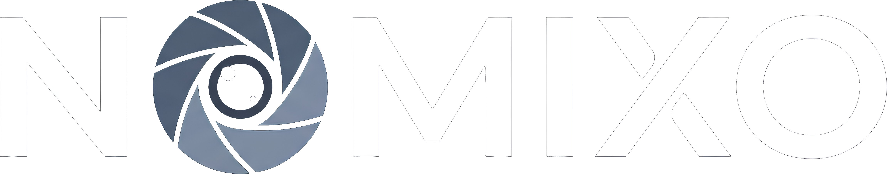

<div align="center">
<picture>
  <source media="(prefers-color-scheme: light)" srcset="./assets/logo/dark-icon.png">
  <source media="(prefers-color-scheme: dark)" srcset="./assets/logo/icon.png">
  
</picture><br/><br />

</div>


## Overview

Nomixo is an Electron app that lets you search, browse, and stream movies and TV shows from your desktop. It pulls metadata from **TMDB**, fetches torrent streams via **Torrentio**, and plays back through **MPV**. No account, no subscription, just a free TMDB API key.


## Features

- **Browse & search** — Home page with popular content, real-time search across movies, shows, and anime, and a Discovery page by genre
- **Streaming** — Torrent-based via WebTorrent, played through MPV with hardware acceleration
- **Downloads** — Full queue with pause, resume, cancel, and reorder support
- **Library & history** — Save favorites, track watch progress, and resume where you left off
- **Subtitles** — Auto-download via Wyzie, or load local `.srt`/`.vtt` files. Configurable font, size, color, and opacity
- **Theming** — Fully customizable colors and appearance via Settings


## Screenshots

<div align="center">
  
  <hr style="border: 0; border-top: 2px solid rgba(255,255,255,0.2); margin: 30px auto; width: 80%;">

  
  <hr style="border: 0; border-top: 2px solid rgba(255,255,255,0.2); margin: 30px auto; width: 80%;">

  
  <hr style="border: 0; border-top: 2px solid rgba(255,255,255,0.2); margin: 30px auto; width: 80%;">

  
</div>


## Requirements

| Dependency | Notes |
|---|---|
| [MPV Player](https://mpv.io/installation/) | Required for all playback |
| [TMDB API Key](https://developer.themoviedb.org/docs/getting-started) | Free, needed on first launch |
| [Wyzie API Key](https://sub.wyzie.io/redeem) *(optional)* | For automatic subtitle search |
| [Node.js](https://nodejs.org/) v18+ | Only needed if running from source |


## Download

Pre-built installers are on the [**Releases page**](https://github.com/Nomix17/Nomixo/releases). Available for:

- **Windows** — installer + portable `.zip`, **with MPV bundled in**, no separate install needed
- **Linux** — `.deb`, `.rpm`, `.tar.gz`, `.AppImage`
- **macOS** — `.dmg`

> ‼️ **MPV must be installed separately on Linux and macOS** (and when running from source). See [mpv.io/installation](https://mpv.io/installation/).


## Running from Source

```bash
git clone https://github.com/Nomix17/Nomixo.git
cd Nomixo
npm install
npm run dev
```

To build a distributable: `npm run build`, output goes to `dist/`.


## How Streaming Works

Nomixo fetches a magnet link from Torrentio, buffers it with WebTorrent, serves it locally over HTTP, and launches MPV pointed at that stream. The app window hides while MPV is in focus and reappears on exit. Playback position is saved automatically.


## Data & Config

Everything lives in Electron's `userData` directory: `settings.json`, `library.json`, `downloads.json`, `Theme.css`, and `mpv/mpv.conf`. API keys are stored in `.env`. Poster cache and streaming cache are in `posters/` and `video_cache/`.
